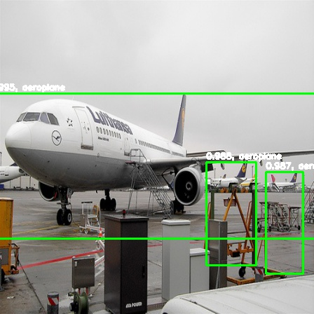
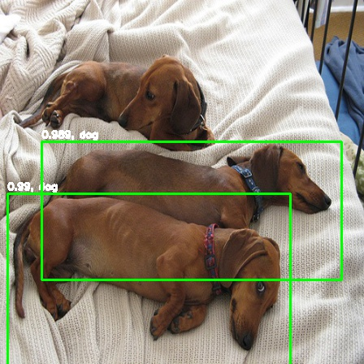
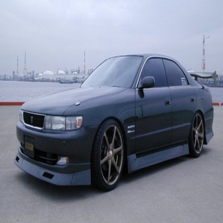
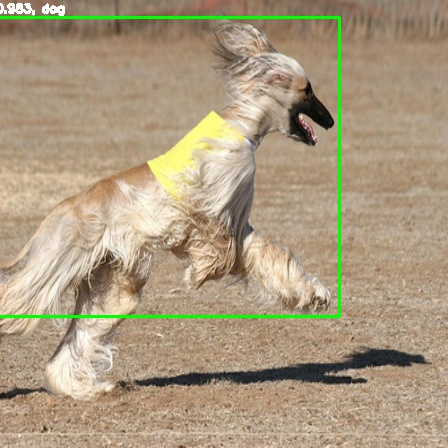
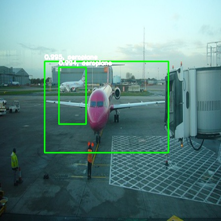

# YOLO V2 - Pytorch 1.4

This project can be used to train and evaluate the YOLO v2 model (Tested with Pascal VOC 2012 dataset). Due to the lack of resources, only aeroplanes and dogs images were used to train and evaluate the model. Below are some of the result of evaluation. Some short notes on the flow of the program is available [here](https://github.com/Ugenteraan/YOLOv2-PyTorch/blob/master/YOLO%20Notes.ipynb) as well.

### Prediction on test images.
        

The model were trained for a limited amount of time. Perhaps with better resources, better results can be obtained.
___
### Training on your own custom image dataset.

In order to train the model with your own custom dataset, please follow the instructions below carefully.

1) Make sure your dataset's label follow the annotation format of Pascal VOC 2012.

2) In `cfg.py`:

    a) Change **DATA_IMAGES_PATH** and **DATA_ANNOTATION_PATH** variables to the path of your own dataset.
    
    b) If you wish to exclude certain classes from your dataset from being trained, include the name of the classes in      the list of variable **EXCLUDED_CLASSES**.
    
3) Download the pre-trained imagenet model from [here](https://drive.google.com/file/d/1pF_BaOFQOIbHPsjrsrZ6BmXZm49IPrrn/view?usp=sharing) and place it in a folder named **_imagenet_model_** in the root directory.

4) You may now start the training with `python train.py` from the root directory.

The model's loss will be shown in every epoch while the mAP will be shown for every 10 epoch. The trained weights will be saved in the `yolo_model` folder. After the training is finished, the anchor data that were used throughout the training will be saved in `anchor_sizes.txt` file. 

**IMPORTANT**: When reusing the trained model for evaluation, `anchor_sizes.txt` must be present as well. 

License
----

MIT

